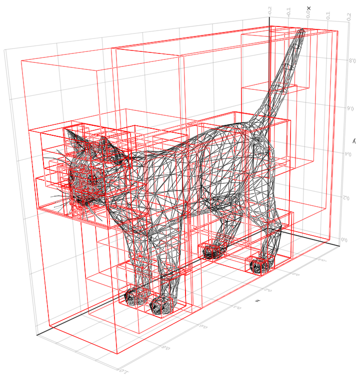
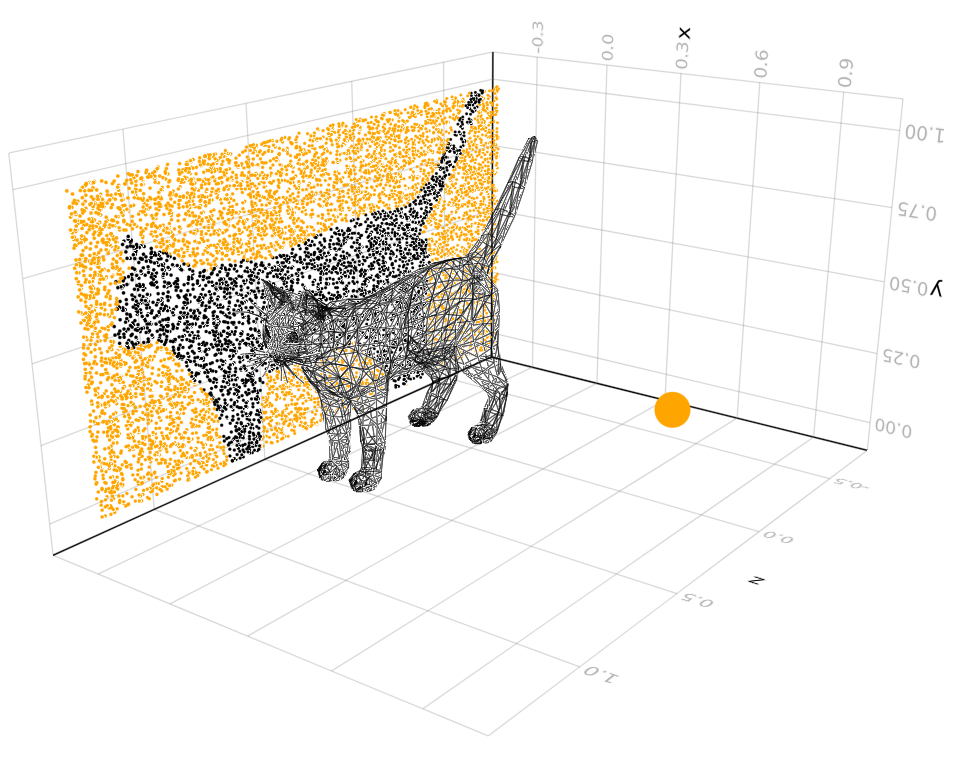

This package implements some basic functionality of a __Bounding Volume Hierarchy__ (`BVH`) of a triangular mesh, in particular a `intersection(segment::Segment, bvh::BVH, vertices, faces, facenormals)` function which gives `true/false` if the segment intersects with the mesh.
As the face indices are stored in a `BVH`, this method reduces the number of evaluated cell intersection checks.

The bounding volumes are axis aligned bounding boxes (`AABB`). The implementation uses `GeometryTypes.jl`, in particular it assumes that all points is of type `Point{3, Float32}` (denoted `PointT` in the code).

_Discalimer_: If you look for performant ray tracing library, look elsewhere. I made this mostly for educational purposes, and had no prior experience in computer graphics. Please let me know if there are simple algorithmic or implementation specific changes which could speed it up.

### Images

Generated by [`examples/example.jl`](examples/example.jl)

Plot of a cat mesh together with the bounding boxes in the Bounding Volume Hierarchy:




Plot of a mesh together with a scatter of the end points of a set of segments. All segments starts at the same center point (large orange ball), and end on a plane on the opposite side of the cat mesh. End points are colored black if the segment intersects with the cat mesh and orange otherwise.



### API

See `examples/example.jl` for more details.

Assume that the triangular mesh is identified by a `vertices` buffer, a `faces` buffer,
(containing triplets of indices of the vertex buffer which identifies mesh cells) and a `facenormals` buffer which contains normal vectors for each cell.

Create a bounding volume hierarchy of the indices of the faces. The cells are divided greedily based on a "Surface Area Heuristic" method [described in section 2.2 here](http://www.sci.utah.edu/~wald/Publications/2007/ParallelBVHBuild/fastbuild.pdf).
```
bvh = buildBVM(vertices, faces)
```

Create a line segment from point `a` to point `b`.
```
seg = Segment(a, b)
```

Check whether the line segment crosses any of the faces in the mesh.
```
hit = intersection(seg, bvh, vertices, faces, facenormals) # true/false
```

Note: The intersection assumes signed mesh cells, and directional `Segments` (from `a` to `b`). An intersection occurs only if the line segments crosses the positive side of the cell, in the positive segment direction (i.e. `a` has to be on the positive side of the cell, and `b` has to be on the negative side).
